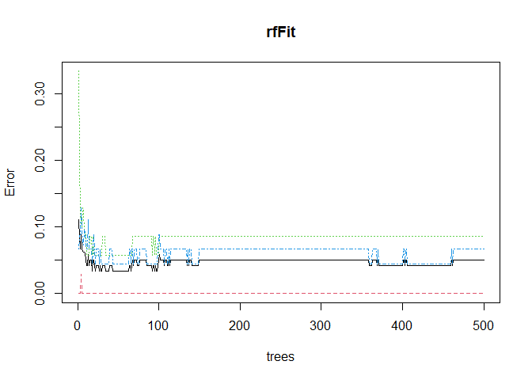

Favorite Machine Learning Method
================
Steph Camino
2022-07-10

``` r
library(knitr)
knitr::opts_chunk$set(fig.path = "../images/")
```

I’ve been exposed to machine learning before this class, but I was
always a little lost, so I was so thankful that I got a good starting
base knowledge in the topic! I’d have to say that Random Forest was my
favorite method as I was able to connect some dots in my real life with
this exposure. For a project last semester, my group and I did a project
with NFL field goal data. My job was to analyse the data taking a
frequentist approach and one of my partner’s took a machine learning
approach using random forest. I was a little mind blown when he was
showing us his results. I wish I could go back with the knowledge I have
now. Also, I’m in St542 Statistical Practice this summer and my group
and I took a machine learning approach using random forest, so I am so
thankful that I was taking this class simultaneously. I find it
interesting that it keeps a strong predictor from dominating the trees
by randomly selecting predictors. I think that’s mighty cool!

Here’s an example of Random Forest!

``` r
data <- iris
data$Species <- as.factor(data$Species)

set.seed(123)
train <- sample(1:nrow(data), size = nrow(data)*0.8)
test <- dplyr::setdiff(1:nrow(data), train)

dataTrain <- data[train, ]
dataTest <- data[test, ]

rfFit <- randomForest(Species ~ ., data = dataTrain, mtry = round(ncol(data)/3), ntree = 500, importance = TRUE)

rfFit
```

    ## 
    ## Call:
    ##  randomForest(formula = Species ~ ., data = dataTrain, mtry = round(ncol(data)/3),      ntree = 500, importance = TRUE) 
    ##                Type of random forest: classification
    ##                      Number of trees: 500
    ## No. of variables tried at each split: 2
    ## 
    ##         OOB estimate of  error rate: 5%
    ## Confusion matrix:
    ##            setosa versicolor virginica class.error
    ## setosa         40          0         0  0.00000000
    ## versicolor      0         32         3  0.08571429
    ## virginica       0          3        42  0.06666667

``` r
plot(rfFit)
```

<!-- -->

``` r
pred <- predict(rfFit, newdata = dataTest)
postResample(pred, dataTest$Species)
```

    ##  Accuracy     Kappa 
    ## 0.9666667 0.9464286
